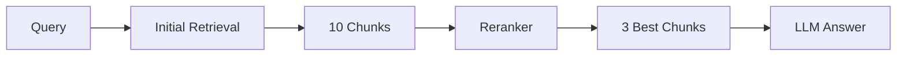

## Overview

Reranking improves retrieval quality by re-scoring and reordering retrieved chunks based on their relevance to the query. Mini RAG supports multiple reranking strategies.

## Why Reranking?

Initial retrieval uses embedding similarity (cosine/dot product), which may not capture all aspects of relevance. Reranking uses more sophisticated models to:

- **Improve precision**: Keep only the most relevant chunks
- **Better relevance scoring**: More accurate than embedding similarity alone
- **Reduce noise**: Filter out marginally relevant results

## Available Rerankers

<CardGroup cols={2}>
  <Card title="LLM-based" icon="brain" href="/api-reference/rerankers/llm">
    Uses your configured LLM
  </Card>
  <Card title="Cohere" icon="cloud" href="/api-reference/rerankers/cohere">
    Specialized reranking API
  </Card>
  <Card title="Sentence Transformer" icon="microchip" href="/api-reference/rerankers/sentence-transformer">
    Local cross-encoder models
  </Card>
  <Card title="None" icon="ban">
    Disable reranking
  </Card>
</CardGroup>

## Comparison

| Reranker | Quality | Speed | Cost | Privacy | Setup |
|----------|---------|-------|------|---------|-------|
| **Cohere** | ⭐⭐⭐⭐⭐ | ⚡⚡⚡ | 💰💰 | Cloud | Easy |
| **LLM-based** | ⭐⭐⭐⭐ | ⚡⚡ | 💰💰 | Cloud | Easy |
| **Sentence Transformer** | ⭐⭐⭐ | ⚡⚡⚡⚡ | Free | Local | Moderate |
| **None** | ⭐⭐ | ⚡⚡⚡⚡⚡ | Free | - | None |

## How Reranking Works



**Pipeline:**
1. Retrieve `top_k` chunks (e.g., 10) using embedding similarity
2. Rerank these chunks with a more sophisticated model
3. Keep `rerank_top_k` best chunks (e.g., 3)
4. Generate answer using only the top chunks

## Basic Usage

```python
from mini import AgenticRAG, RetrievalConfig, RerankerConfig

rag = AgenticRAG(
    vector_store=vector_store,
    embedding_model=embedding_model,
    retrieval_config=RetrievalConfig(
        top_k=10,           # Retrieve 10 chunks
        rerank_top_k=3,     # Keep top 3 after reranking
        use_reranking=True  # Enable reranking
    ),
    reranker_config=RerankerConfig(
        type="cohere"  # or "llm", "sentence-transformer", "none"
    )
)
```

## Choosing a Reranker

### Use **Cohere** When:
- Quality is paramount
- You have budget for API calls
- Processing English text
- Want best-in-class reranking

### Use **LLM-based** When:
- Already using an LLM for generation
- Want simple setup (no extra API)
- Have good LLM access
- Budget for LLM tokens

### Use **Sentence Transformer** When:
- Need local/private deployment
- Have GPU available
- Want to avoid API costs
- Processing many queries

### Use **None** When:
- Speed is critical
- Initial retrieval is good enough
- Processing simple queries
- Minimizing latency/cost

## Configuration Examples

### Production (Cohere)

```python
reranker_config = RerankerConfig(
    type="cohere",
    kwargs={
        "api_key": os.getenv("COHERE_API_KEY"),
        "model": "rerank-english-v3.0"
    }
)
```

### Development (LLM)

```python
reranker_config = RerankerConfig(
    type="llm"
)
```

### Local (Sentence Transformer)

```python
reranker_config = RerankerConfig(
    type="sentence-transformer",
    kwargs={
        "model_name": "cross-encoder/ms-marco-MiniLM-L-6-v2",
        "device": "cuda"
    }
)
```

### Disabled

```python
reranker_config = RerankerConfig(
    type="none"
)
```

## Performance Impact

### Latency

- **Cohere**: +50-100ms
- **LLM-based**: +500-1000ms (depends on LLM)
- **Sentence Transformer**: +100-200ms (GPU), +500ms (CPU)
- **None**: 0ms

### Cost

- **Cohere**: ~$1 per 1000 searches (1000 docs)
- **LLM-based**: Depends on LLM pricing and chunk size
- **Sentence Transformer**: Free (after model download)
- **None**: Free

### Quality Improvement

Typical improvements in retrieval quality:
- **Cohere**: +20-40% better precision
- **LLM-based**: +15-30% better precision
- **Sentence Transformer**: +10-25% better precision
- **None**: Baseline

## Best Practices

<AccordionGroup>
  <Accordion title="Tune top_k and rerank_top_k">
    Cast a wide net, then narrow down:
    
    ```python
    # Good: Retrieve more, keep less
    RetrievalConfig(top_k=15, rerank_top_k=3)
    
    # Less effective: Retrieve few, keep most
    RetrievalConfig(top_k=5, rerank_top_k=4)
    ```
  </Accordion>
  
  <Accordion title="Combine with Query Rewriting">
    Reranking works best with query rewriting:
    
    ```python
    RetrievalConfig(
        use_query_rewriting=True,  # Generate variations
        use_reranking=True         # Rerank results
    )
    ```
  </Accordion>
  
  <Accordion title="Match Reranker to Use Case">
    - **Customer-facing**: Cohere for best quality
    - **Internal tools**: LLM or Sentence Transformer
    - **High-volume**: Sentence Transformer (local)
    - **Prototyping**: LLM (simple setup)
  </Accordion>
</AccordionGroup>

## Custom Reranker

Implement your own reranker:

```python
from mini.reranker import BaseReranker, RerankResult
from typing import List, Optional

class CustomReranker(BaseReranker):
    def rerank(
        self,
        query: str,
        documents: List[str],
        top_k: Optional[int] = None
    ) -> List[RerankResult]:
        # Your custom reranking logic
        scores = [self.score(query, doc) for doc in documents]
        
        results = [
            RerankResult(index=i, score=score, document=doc)
            for i, (doc, score) in enumerate(zip(documents, scores))
        ]
        
        # Sort by score
        results.sort(key=lambda x: x.score, reverse=True)
        
        return results[:top_k] if top_k else results

# Use custom reranker
custom_reranker = CustomReranker()
reranker_config = RerankerConfig(custom_reranker=custom_reranker)
```

## Next Steps

<CardGroup cols={3}>
  <Card title="Cohere Reranker" href="/api-reference/rerankers/cohere">
    Cohere API details
  </Card>
  <Card title="LLM Reranker" href="/api-reference/rerankers/llm">
    LLM-based reranking
  </Card>
  <Card title="Sentence Transformer" href="/api-reference/rerankers/sentence-transformer">
    Local reranking
  </Card>
</CardGroup>

