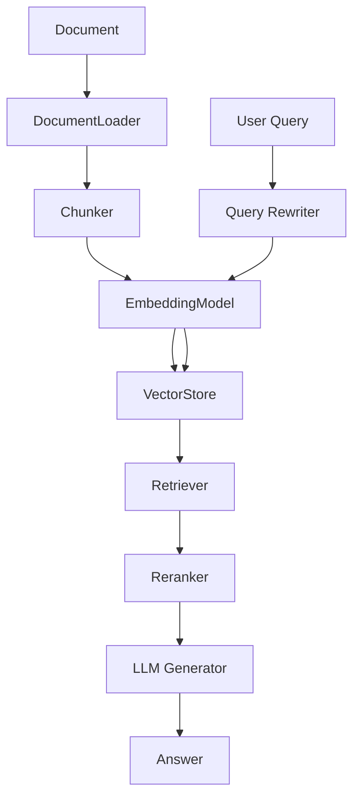

## What is RAG?

**Retrieval-Augmented Generation (RAG)** is a technique that enhances Large Language Models (LLMs) by providing them with relevant information from external knowledge sources. Instead of relying solely on the model's training data, RAG systems:

1. **Retrieve** relevant information from a knowledge base
2. **Augment** the user's query with this context
3. **Generate** an informed response using an LLM

## Mini RAG Architecture

Mini RAG follows a modular, pipeline-based architecture that makes it easy to understand, customize, and extend:



## Core Components

<CardGroup cols={2}>
  <Card title="Document Loader" icon="file-import" href="/core/document-loading">
    Load and parse documents from multiple formats (PDF, DOCX, images, etc.)
  </Card>
  <Card title="Chunker" icon="scissors" href="/core/chunking">
    Split documents into optimal chunks for embedding and retrieval
  </Card>
  <Card title="Embedding Model" icon="wand-magic-sparkles" href="/core/embeddings">
    Convert text into vector embeddings for semantic search
  </Card>
  <Card title="Vector Store" icon="database" href="/core/vector-store">
    Store and search embeddings using Milvus
  </Card>
</CardGroup>

## The RAG Pipeline

### 1. Indexing Phase

When you index a document, Mini RAG performs the following steps:

<Steps>
  <Step title="Load Document">
    The `DocumentLoader` reads and converts the document to text using MarkItDown
  </Step>
  <Step title="Chunk Text">
    The `Chunker` splits the text into optimal chunks using Chonkie
  </Step>
  <Step title="Generate Embeddings">
    The `EmbeddingModel` converts each chunk into a vector embedding
  </Step>
  <Step title="Store Vectors">
    The `VectorStore` saves embeddings and metadata to Milvus
  </Step>
</Steps>

```python
# Example: Indexing a document
rag = AgenticRAG(vector_store=vector_store, embedding_model=embedding_model)
num_chunks = rag.index_document("research_paper.pdf")
print(f"Indexed {num_chunks} chunks")
```

### 2. Query Phase

When you query the system, Mini RAG:

<Steps>
  <Step title="Rewrite Query (Optional)">
    Generate multiple query variations to improve retrieval coverage
  </Step>
  <Step title="Embed Query">
    Convert the query (and variations) into vector embeddings
  </Step>
  <Step title="Search">
    Find the most similar chunks using vector search (or hybrid search)
  </Step>
  <Step title="Rerank (Optional)">
    Re-rank retrieved chunks for better relevance
  </Step>
  <Step title="Generate Answer">
    Use LLM to generate an answer based on retrieved context
  </Step>
</Steps>

```python
# Example: Querying
response = rag.query("What are the key findings?")
print(response.answer)
```

## Modular Design

One of Mini RAG's strengths is its modularity. You can:

### Use Individual Components

```python
from mini.loader import DocumentLoader
from mini.chunker import Chunker
from mini.embedding import EmbeddingModel

# Use components independently
loader = DocumentLoader()
text = loader.load("document.pdf")

chunker = Chunker()
chunks = chunker.chunk(text)

embedding_model = EmbeddingModel()
embeddings = embedding_model.embed_chunks(chunks)
```

### Mix and Match

```python
# Use your own chunking strategy
chunks = my_custom_chunker(text)

# But use Mini RAG for embeddings and storage
embeddings = embedding_model.embed_chunks(chunks)
vector_store.insert(embeddings, chunks)
```

### Build Custom Pipelines

```python
# Create your own RAG pipeline
class CustomRAG:
    def __init__(self):
        self.loader = DocumentLoader()
        self.chunker = Chunker()
        self.embedding_model = EmbeddingModel()
        self.vector_store = VectorStore(...)
    
    def index(self, path):
        text = self.loader.load(path)
        chunks = self.chunker.chunk(text)
        embeddings = self.embedding_model.embed_chunks(chunks)
        return self.vector_store.insert(embeddings, chunks)
```

## Configuration-Based API

Mini RAG uses a clean, configuration-based API that organizes settings into logical groups:

```python
from mini import AgenticRAG, LLMConfig, RetrievalConfig, RerankerConfig

rag = AgenticRAG(
    vector_store=vector_store,
    embedding_model=embedding_model,
    # LLM settings
    llm_config=LLMConfig(
        model="gpt-4o-mini",
        temperature=0.7
    ),
    # Retrieval settings
    retrieval_config=RetrievalConfig(
        top_k=10,
        use_query_rewriting=True,
        use_hybrid_search=True
    ),
    # Reranker settings
    reranker_config=RerankerConfig(
        type="cohere"
    )
)
```

### Benefits

<CardGroup cols={2}>
  <Card title="Better Organization" icon="folder">
    Related settings grouped together logically
  </Card>
  <Card title="Type Safety" icon="shield-check">
    Validated with Pydantic dataclasses
  </Card>
  <Card title="Easy Maintenance" icon="wrench">
    Change one config without affecting others
  </Card>
  <Card title="Clear Code" icon="book">
    Self-documenting configuration objects
  </Card>
</CardGroup>

## Key Design Principles

<AccordionGroup>
  <Accordion title="Simplicity First">
    Mini RAG prioritizes ease of use. Get started with just a few lines of code, then customize as needed.
  </Accordion>
  
  <Accordion title="Production Ready">
    Built with production use cases in mind: error handling, retries, timeouts, observability, and comprehensive configuration.
  </Accordion>
  
  <Accordion title="Modular & Extensible">
    Use the full pipeline or individual components. Easy to extend with custom implementations.
  </Accordion>
  
  <Accordion title="Pythonic API">
    Clean, intuitive API that follows Python best practices and conventions.
  </Accordion>
  
  <Accordion title="Type Safe">
    Leverages Pydantic for data validation and type safety throughout the library.
  </Accordion>
</AccordionGroup>

## Understanding the Response

When you query Mini RAG, you get a comprehensive response object:

```python
response = rag.query("What is the budget?")

# Access different parts of the response
print(response.answer)              # Generated answer
print(response.original_query)      # Your original query
print(response.rewritten_queries)   # Query variations (if enabled)
print(response.retrieved_chunks)    # Retrieved context chunks
print(response.metadata)            # Additional metadata

# Inspect retrieved chunks
for chunk in response.retrieved_chunks:
    print(chunk.text)               # Chunk text
    print(chunk.score)              # Similarity score
    print(chunk.reranked_score)     # Reranked score (if enabled)
    print(chunk.metadata)           # Chunk metadata
```

## Next Steps

<CardGroup cols={2}>
  <Card title="Document Loading" icon="file-import" href="/core/document-loading">
    Learn how to load documents from various formats
  </Card>
  <Card title="Chunking" icon="scissors" href="/core/chunking">
    Understand text chunking strategies
  </Card>
  <Card title="Embeddings" icon="wand-magic-sparkles" href="/core/embeddings">
    Explore embedding generation options
  </Card>
  <Card title="Vector Store" icon="database" href="/core/vector-store">
    Master vector storage and search
  </Card>
</CardGroup>

