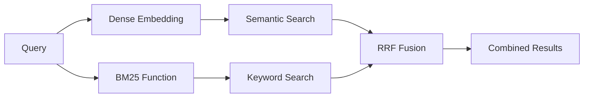

## Overview

Hybrid search combines two complementary search methods:

1. **Semantic Search (Dense Vectors)**: Finds conceptually similar content using embeddings
2. **BM25 Search (Sparse Vectors)**: Finds exact keyword matches using traditional IR

By combining both, you get the best of both worlds—conceptual understanding and exact matching.

## How It Works



Milvus uses **RRF (Reciprocal Rank Fusion)** to combine results from both search methods into a unified ranked list.

## Quick Start

```python
import os
from mini import AgenticRAG, EmbeddingModel, VectorStore, RetrievalConfig

# Initialize with hybrid search
embedding_model = EmbeddingModel()

vector_store = VectorStore(
    uri=os.getenv("MILVUS_URI"),
    token=os.getenv("MILVUS_TOKEN"),
    collection_name="hybrid_docs",
    dimension=1536
)

rag = AgenticRAG(
    vector_store=vector_store,
    embedding_model=embedding_model,
    retrieval_config=RetrievalConfig(
        use_hybrid_search=True  # Enable hybrid search
    )
)

# Index documents (BM25 sparse vectors auto-generated)
rag.index_document("document.pdf")

# Query with hybrid search
response = rag.query("budget allocation for railways")
print(response.answer)
```

## When to Use Hybrid Search

<CardGroup cols={2}>
  <Card title="Use Hybrid When" icon="check">
    - Queries contain specific technical terms
    - Exact keyword matches are important
    - Dealing with proper nouns or acronyms
    - Need both conceptual and literal matching
    - Working with domain-specific terminology
  </Card>
  
  <Card title="Use Semantic Only When" icon="info">
    - Queries are mostly conceptual
    - Semantic similarity is more important
    - Simpler setup is preferred
    - Keywords are less relevant
  </Card>
</CardGroup>

## Comparison

### Semantic Search Only

```python
# Good for conceptual queries
rag = AgenticRAG(
    vector_store=vector_store,
    embedding_model=embedding_model,
    retrieval_config=RetrievalConfig(
        use_hybrid_search=False  # Semantic only
    )
)

# Example query
response = rag.query("How can we improve infrastructure?")
# Finds conceptually related content about infrastructure improvements
```

### Hybrid Search

```python
# Good for mixed queries
rag = AgenticRAG(
    vector_store=vector_store,
    embedding_model=embedding_model,
    retrieval_config=RetrievalConfig(
        use_hybrid_search=True  # Hybrid search
    )
)

# Example query
response = rag.query("G20 summit infrastructure announcement")
# Finds both:
# - Semantic: infrastructure-related content
# - Keyword: exact matches for "G20 summit"
```

## Configuration

### Enable Hybrid Search

```python
from mini import RetrievalConfig

rag = AgenticRAG(
    vector_store=vector_store,
    embedding_model=embedding_model,
    retrieval_config=RetrievalConfig(
        use_hybrid_search=True,
        rrf_k=60  # RRF constant for result fusion
    )
)
```

### RRF Parameter

The `rrf_k` parameter controls how results are combined:

- **Lower values** (e.g., 20-40): Give more weight to top-ranked results
- **Higher values** (e.g., 60-80): Distribute weight more evenly
- **Default**: 60 (balanced approach)

```python
# More weight to top results
retrieval_config = RetrievalConfig(
    use_hybrid_search=True,
    rrf_k=30
)

# More balanced weighting
retrieval_config = RetrievalConfig(
    use_hybrid_search=True,
    rrf_k=70
)
```

## How BM25 Works

BM25 (Best Match 25) is a ranking function used in information retrieval:

- **Term frequency**: How often a term appears in a document
- **Inverse document frequency**: How rare a term is across all documents
- **Document length normalization**: Adjusts for document size

**Advantages:**
- Excellent for exact keyword matches
- Handles rare terms well
- Works great with proper nouns and acronyms
- Fast and efficient

## Hybrid Search with Re-ranking

Combine hybrid search with re-ranking for best results:

```python
from mini import AgenticRAG, RetrievalConfig, RerankerConfig

rag = AgenticRAG(
    vector_store=vector_store,
    embedding_model=embedding_model,
    retrieval_config=RetrievalConfig(
        top_k=15,               # Retrieve more candidates
        rerank_top_k=5,         # Keep top 5 after reranking
        use_hybrid_search=True, # Hybrid retrieval
        use_reranking=True      # Enable reranking
    ),
    reranker_config=RerankerConfig(
        type="cohere"  # or "llm", "sentence-transformer"
    )
)
```

**Pipeline:**
1. Hybrid search retrieves 15 chunks (semantic + BM25)
2. RRF combines results
3. Reranker selects top 5 most relevant
4. LLM generates answer from top 5

## Examples

### Example 1: Technical Documentation

```python
# Query with specific terms
response = rag.query("JWT authentication implementation")

# Hybrid search finds:
# - Semantic: Authentication-related content
# - Keyword: Exact "JWT" matches
```

### Example 2: Budget Queries

```python
# Query with specific keywords
response = rag.query("budget allocation for railways 2024")

# Hybrid search finds:
# - Semantic: Budget-related content
# - Keyword: "railways", "2024"
```

### Example 3: Proper Nouns

```python
# Query with proper nouns
response = rag.query("G20 summit India theme")

# Hybrid search finds:
# - Semantic: Summit and theme-related content
# - Keyword: "G20", "India"
```

## Performance Considerations

<AccordionGroup>
  <Accordion title="Speed">
    Hybrid search is slightly slower than semantic-only search due to:
    - Two parallel searches (semantic + BM25)
    - RRF fusion computation
    
    **Impact:** Usually negligible (<50ms extra)
  </Accordion>

  <Accordion title="Storage">
    Hybrid search requires storing sparse vectors:
    - Dense vectors: ~6KB per chunk (1536 dimensions × 4 bytes)
    - Sparse vectors: ~1-2KB per chunk (variable)
    
    **Impact:** ~20-30% more storage
  </Accordion>

  <Accordion title="Quality">
    Hybrid search typically improves retrieval quality by:
    - 10-30% better recall (finds more relevant results)
    - Better handling of specific terms
    - Improved handling of edge cases
  </Accordion>
</AccordionGroup>

## Best Practices

<AccordionGroup>
  <Accordion title="Query Types">
    **Match search strategy to query type:**
    
    ```python
    # Conceptual queries → Semantic
    # "How to improve user experience"
    
    # Specific terms → Hybrid
    # "React hooks useState implementation"
    
    # Mixed → Hybrid
    # "G20 infrastructure development initiatives"
    ```
  </Accordion>

  <Accordion title="Document Types">
    **Consider document characteristics:**
    
    - **Technical docs**: Hybrid (lots of specific terms)
    - **Narrative content**: Semantic (conceptual)
    - **Mixed content**: Hybrid (safe default)
  </Accordion>

  <Accordion title="Combine with Reranking">
    **Use hybrid search + reranking for best results:**
    
    ```python
    retrieval_config = RetrievalConfig(
        top_k=15,
        rerank_top_k=5,
        use_hybrid_search=True,
        use_reranking=True
    )
    ```
  </Accordion>
</AccordionGroup>

## Comparison Example

Let's compare semantic-only vs hybrid search:

```python
# Setup both systems
rag_semantic = AgenticRAG(
    vector_store=semantic_store,
    embedding_model=embedding_model,
    retrieval_config=RetrievalConfig(use_hybrid_search=False)
)

rag_hybrid = AgenticRAG(
    vector_store=hybrid_store,
    embedding_model=embedding_model,
    retrieval_config=RetrievalConfig(use_hybrid_search=True)
)

# Query with specific terms
query = "budget allocation railways"

# Semantic search results
semantic_response = rag_semantic.query(query)
print("Semantic:", semantic_response.answer[:200])

# Hybrid search results
hybrid_response = rag_hybrid.query(query)
print("Hybrid:", hybrid_response.answer[:200])
```

## Troubleshooting

<AccordionGroup>
  <Accordion title="Hybrid search not working">
    **Solution:** Ensure hybrid search is enabled during VectorStore creation:
    
    ```python
    # The AgenticRAG handles this automatically
    rag = AgenticRAG(
        vector_store=vector_store,
        embedding_model=embedding_model,
        retrieval_config=RetrievalConfig(
            use_hybrid_search=True
        )
    )
    ```
  </Accordion>

  <Accordion title="Poor BM25 results">
    **Solution:** BM25 works best with:
    - Properly cleaned text
    - Good tokenization
    - Sufficient document diversity
    
    Adjust RRF parameter if needed:
    
    ```python
    retrieval_config = RetrievalConfig(
        use_hybrid_search=True,
        rrf_k=40  # More weight to top results
    )
    ```
  </Accordion>

  <Accordion title="Semantic vs Hybrid not clear">
    **Solution:** Test both on your specific use case:
    
    ```python
    # Run comparison
    test_queries = [
        "specific technical term",
        "conceptual question",
        "mixed query with keywords"
    ]
    
    for query in test_queries:
        semantic = rag_semantic.query(query)
        hybrid = rag_hybrid.query(query)
        # Compare results
    ```
  </Accordion>
</AccordionGroup>

## Under the Hood

When you enable hybrid search, Mini RAG:

1. **Creates sparse vector field** in Milvus collection
2. **Registers BM25 function** for keyword scoring
3. **Generates BM25 vectors** automatically during indexing
4. **Executes hybrid search** with RRF fusion during queries

All of this is handled automatically—you just set `use_hybrid_search=True`.

## Next Steps

<CardGroup cols={2}>
  <Card title="Re-ranking" icon="ranking-star" href="/features/reranking">
    Combine hybrid search with re-ranking
  </Card>
  <Card title="Query Rewriting" icon="pen" href="/features/query-rewriting">
    Improve retrieval with query variations
  </Card>
  <Card title="AgenticRAG" icon="robot" href="/features/agentic-rag">
    Learn about the complete pipeline
  </Card>
  <Card title="Examples" icon="lightbulb" href="/examples/document-qa">
    See practical examples
  </Card>
</CardGroup>

